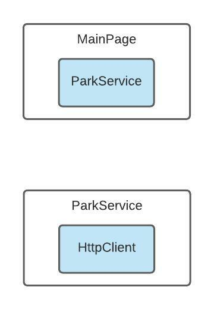

# Xamarin.Forms Dependency Injection Study
This repository contains a Xamarin.Forms application for studying Dependency Injection. The app loads a list of Tennesse State Parks from the [Find a Park endpoint](https://gis.tnstateparks.com/datasets/TDEC::find-a-park-data/about).

Android | iOS
:---: | :---:
|  | 

## Studies

### [No Dependency Injection](NoDependencyInjection)

No dependency injection involves instantiating classes directly where they are needed.

```csharp
namespace NoDependencyInjection.Services
{
    public class ParkService
    {
        private readonly HttpClient _client;

        public ParkService()
        {
            _client = new HttpClient();
        }

        ...
    }
}
```



**Benefits**

* "Quick and dirty" way to write code

**Trade-offs**

* No separation of concerns
* Classes are open for modification (violates Open/Closed Principle)
* Not suitable for production grade apps with multiple services

### [Service Locator Pattern](ServiceLocator)

The service locator pattern allows you to move the concrete implementations of your dependencies into a separate location, commonly called a "service container". You then get the concretion calling a method on the container.

**Note:** My main study used the [Microsoft.Extensions.DependencyInjection](https://www.nuget.org/packages/Microsoft.Extensions.DependencyInjection) library to create the container. However, you aren't required to use a library. You can simply use a static class. See [ServiceLocatorStatic](ServiceLocatorStatic) for an example approach.

```c#
namespace ServiceLocator.Services
{
    public class ParkService
    {
        private readonly HttpClient _client;

        public ParkService()
        {
            _client = Dependencies.ServiceProvider.GetRequiredService<HttpClient>();
        }

        ...
    }
}
```


**Benefits**

* Creates separation of concerns
* Easy to understand
* Just-in-time service requests (services are resolved at runtime rather than compile time)

**Trade-offs**

* Difficult to mock and unit test because code references the container
* Creates a global dependency (direct reference to the container)
* Difficult to identify what dependencies are used and where
* Can't detect missing dependencies before runtime

### [Dependency Injection Pattern](DependencyInjection)

The dependency injection pattern gives complete control of resolving dependencies to the service container. Each classes has no knowledge of how the dependency is constructed. They simply accept what they are given.

```c#
namespace DependencyInjection.Services
{
    public class ParkService
    {
        private readonly HttpClient _client;

        public ParkService(HttpClient client)
        {
            _client = client;
        }

        ...
    }
}
```


**Benefits**

* Code does not reference the container, only real dependencies
* Easy to identify which dependencies are used for each class
* Easy to mock dependencies and unit test classes

**Trade-offs**

* Steep learning curve
* Can degrade performance if not implemented correctly

## References

- [Working with Remote Data in Xamarin.Forms Applications](https://www.pluralsight.com/courses/remote-data-xamarin-forms-applications)
- [Use a service locator to register and retrieve dependencies](https://docs.microsoft.com/en-us/learn/modules/explore-cross-platform-design-patterns/8-use-a-service-locator-to-register-and-retrieve-dependencies)
- [Use an IoC container to automatically inject dependencies](https://docs.microsoft.com/en-us/learn/modules/explore-cross-platform-design-patterns/10-use-an-ioc-container-to-automatically-inject-dependencies)
- [SOLID Principles for C# Developers](https://www.pluralsight.com/courses/csharp-solid-principles)
